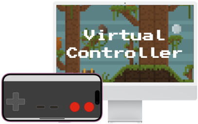

# Virtual Controller

Use an iPhone to emulate retro game controllers and use it in any game
or app that supports USB HID game controllers on a Mac.

# Configuring you Mac for DriverKit development

1. Temporarily turn off SIP

    a. Restart in Recovery Mode

    b. In Terminal run the command `csrutil disable`

    c. Restart

2. Enter dext development mode

        % systemextensionsctl developer on

3. The project configuration for Develoment should be configured to
   build and install the driver from the VirtualController Mac App.
